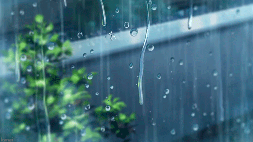

# Hi 💧 I'm Rain!

## Software Engineer

I build accessible, user-centered web applications that make everyday experiences simpler.

Founder of **[Rain With Code](https://www.rainwithcode.com/)** · Event Lead at **freeCodeCamp**

💼 Open to software engineering opportunities and collaborations

## ✨ Featured Work
### [Bits ’N Speeches](https://bitsnspeeches.org/)
A production web platform for managing Toastmasters meetings, guest registrations, and club operations.

## 🛠️ Tech Stack

## 💻 Find Me Online

- 🌧️ [rainwithcode.com](https://www.rainwithcode.com/)
- 💼 [LinkedIn](https://www.linkedin.com/in/rain-kalugdan)
- 🦋 [Bluesky](https://bsky.app/profile/rainwithcode.bsky.social)
- 💌 [hello@rainwithcode.com](mailto:hello@rainwithcode.com?subject=Hey%20Rain&body=Hi%20Rain%2C%0A%0AI%20came%20across%20your%20GitHub%20and%20wanted%20to%20reach%20out...)

---

🤍 When I'm not coding, you'll probably find me listening to podcasts, spending time with dogs, or watching Thai dramas.
